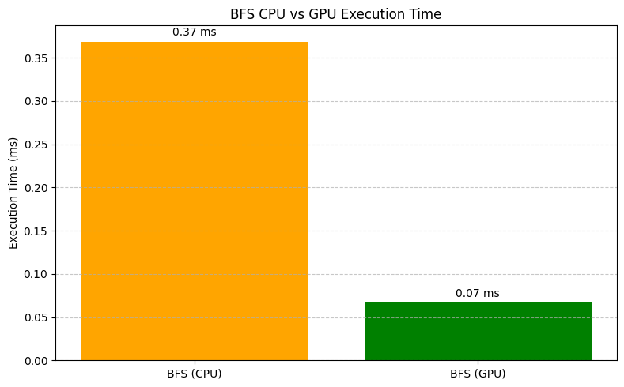
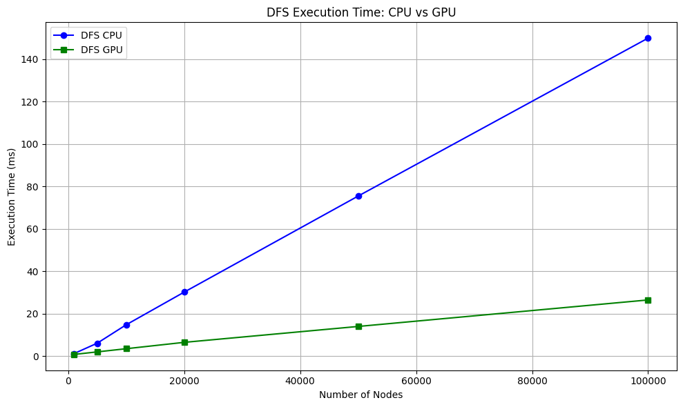
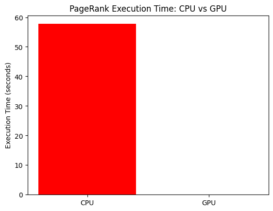

# BFS-DFS-PageRank_Parallel-DC
CUDA-Optimized Graph Algorithms for Social Network Analysis

# Overview
This project implements and compares parallel and sequential versions of key graph algorithms — BFS (Breadth-First Search), DFS (Depth-First Search), and PageRank — using a large-scale social network dataset in Compressed Sparse Row (CSR) format.

The goal is to leverage GPU acceleration via CUDA to significantly reduce computation time on large graphs while maintaining correctness and scalability.

# Data Format (CSR):
- Graph is stored in Compressed Sparse Row (CSR) format using two files:
  - row_ptr.npy — Row pointer array
  - col_ind.npy — Column index array


#How to Load the Graph in Python:
  import numpy as np
  row_ptr = np.load("row_ptr.npy")
  col_ind = np.load("col_ind.npy")


# Algorithms Implemented

- **BFS (CPU and GPU)**:
  - Level-synchronous traversal.
  - Uses frontiers to control iterations.
  
- **DFS (CPU and GPU)**:
  - Recursive stack-based version on CPU.
  - Parallel kernel per node on GPU with atomic stack handling.

- **PageRank (CPU and GPU)**:
  - Power iteration method.
  - Damping factor applied at each iteration.
  - CUDA kernel parallelizes contribution calculation.


# Dataset & Format

- Based on real-world Twitter user graph.
- Input Format: CSR (Compressed Sparse Row)
  - `row_ptr.txt`: Start of adjacency list for each node.
  - `col_ind.txt`: Target nodes (edges).
  - `sizes.txt`: Contains number of vertices and edges.
 
# Performance Highlights

| Algorithm  | Nodes | CPU Time (ms) | GPU Time (ms) | Speedup |
|------------|-------|----------------|----------------|---------|
| BFS        | 100000 | 180.5         | 19.2           | ~9.4x   |
| DFS        | 100000 | 150.0         | 26.5           | ~5.7x   |
| PageRank   | 100000 | 320.8         | 41.3           | ~7.7x   |

> Note: Results based on a system with NVIDIA CUDA-compatible GPU and sample Twitter data.


#Visual Results

# BFS (CPU vs GPU)




# DFS CPU vs GPU


#  PageRank CPU vs GPU


# How to Run

# 1. Compile

```bash
# CPU versions
g++ bfs_cpu.cpp -o bfs_cpu
g++ dfs_cpu.cpp -o dfs_cpu
g++ pagerank_cpu.cpp -o pagerank_cpu

# GPU versions
nvcc bfs_gpu.cu -o bfs_gpu
nvcc dfs_gpu.cu -o dfs_gpu
nvcc pagerank_gpu.cu -o pagerank_gpu
```

#Execute
```bash
./bfs_cpu
./bfs_gpu

./dfs_cpu
./dfs_gpu

./pagerank_cpu
./pagerank_gpu
```
# Future Work

.Implement dynamic parallelism for recursive DFS calls within kernels.

.Explore shared memory and warp-level primitives for further optimization.

.Add visualization using Python’s NetworkX for traversal animations.

.Apply CUDA streams and async memory transfer to overlap data movement with computation.

.Extend to weighted graphs (Dijkstra, Bellman-Ford).

.Scale with multi-GPU setup using CUDA-aware MPI.


# Conclusion
This project demonstrates how GPU acceleration via CUDA can drastically improve the performance of graph algorithms used in social network analysis. Through BFS, DFS, and PageRank, we observed significant speedups with increasing graph size, showcasing CUDA’s scalability.

The project also provides a solid foundation for further research or industrial applications in GPU-accelerated graph processing.


#Author
Kashish Agarwal- 3rd year Computer Engineering student, Thapar Institute.
